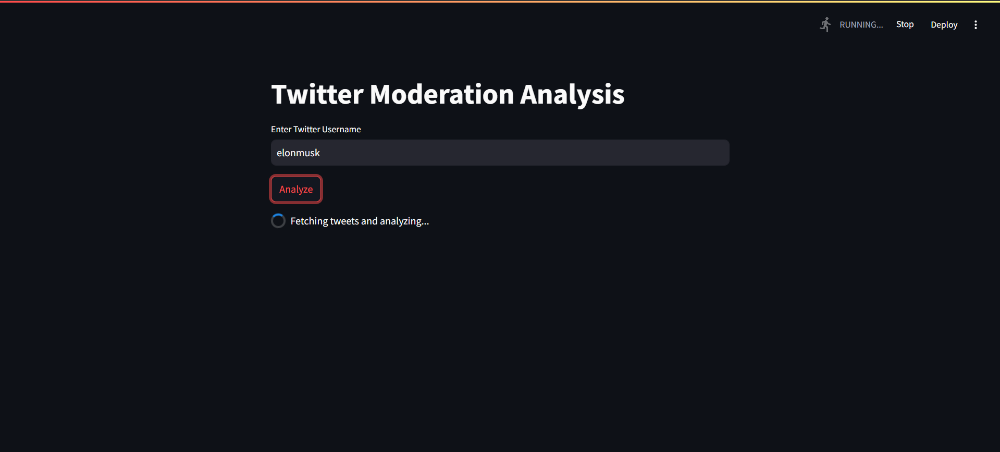
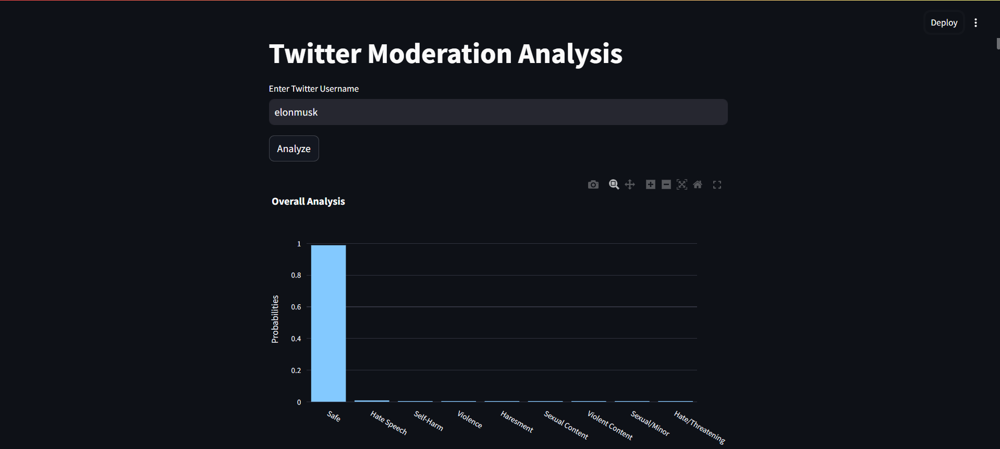

# Twitter/X Profile Classification

This project is a **Twitter/X Profile Analysis Tool** that is designed to analyze and moderate Twitter/X profiles based on the content of their recent tweets. It fetches tweets from a specified Twitter/X user, analyzes them using a pre-trained text moderation model, and visualizes the results with a modern Streamlit interface. The tool provides overall analysis, individual tweet analysis, and detailed label definitions for enhanced clarity.
The project includes files for fetching tweets, single text model processing, batch texts processing, and real-time analysis capabilities, with a Streamlit-based web interface for user interaction.

## Features

- **User-Friendly Interface**: A modern, interactive Streamlit-based web app.
- **Twitter/X Integration**: Fetches a user's recent tweets via the Twitter/X API.
- **Text Moderation**: Classifies tweets into categories such as "Hate Speech", "Violence", and more using the `KoalaAI/Text-Moderation` model.
- **Visualizations**:
  - Overall analysis chart displaying probabilities for each label.
  - Individual tweet analysis with detailed charts.

## Labels and Definitions

| Label | Description |
|-------|-------------|
| **OK** | Not offensive |
| **S**  | Content meant to arouse sexual excitement or promote sexual services (excluding sex education and wellness). |
| **H**  | Content that expresses, incites, or promotes hate based on race, gender, ethnicity, religion, nationality, sexual orientation, disability status, or caste. |
| **V**  | Content that promotes or glorifies violence or celebrates the suffering or humiliation of others. |
| **HR** | Content that may be used to torment or annoy individuals in real life, or make harassment more likely to occur. |
| **SH** | Content that promotes, encourages, or depicts acts of self-harm, such as suicide, cutting, and eating disorders. |
| **S3** | Sexual content involving individuals under 18 years old. |
| **H2** | Hateful content that includes violence or serious harm towards the targeted group. |
| **V2** | Violent content depicting death, violence, or serious physical injury in extreme graphic detail. |

## Requirements

- Python 3.8+
- Twitter/X Developer Account for API access

### Python Packages
- `streamlit`
- `transformers`
- `torch`
- `requests`
- `plotly`

## Installation

1. Clone this repository:
   ```bash
   git clone https://github.com/lokeshch185/twitter-profile-classification.git
   cd twitter-profile-classification
   ```  

2. Install dependencies:
   ```bash
   pip install -r requirements.txt
   ```

3. Set up your Twitter API credentials:
   - Replace `YOUR_TWITTER_API_BEARER_TOKEN` in the code with your Bearer Token.

4. Run the Streamlit app:
   ```bash
   streamlit run app.py
   ```

## Note 

- It fetches only last 10 tweets made by a user due to api constraints. A request can be made only once eveery 15 minutes through the twitter api.


## Usage

1. Enter a Twitter/X username in the input field.
2. View the user's recent tweets.
3. Analyze overall moderation results and individual tweet analyses with detailed charts.

## File Structure

```
.
├── app.py                 # Main Streamlit application file
├── requirements.txt       # Required Python packages
├── README.md              # Project documentation
├── batch_processing.py    # Batch processing script for tweet analysis
├── model.py               # Model implementation for tweet classification
├── tweetExtractor.py      # Script to extract tweets from Twitter API
├── twitter_profile_moderator.py # CLI script for Twitter profile moderation

```


## ScreenShots

Input Page:


Analysis Page:


## Future Enhancements

- The model is not highly accurate and needs to be trained on twitter data.
- Adding support for batch analysis of multiple users.
- Improve visualizations with advanced interactive charts.
- Include multilingual support for non-English tweets.

## Use Cases

- **Content Moderation**: Analyze a user's tweets to identify potentially harmful or offensive content and flag them.
- **Parental Monitoring**: Evaluate the nature of tweets by minors for harmful or inappropriate content.
- **Community Management**: Assist moderators in identifying toxic behavior within a community.
- **Brand Safety**: Ensure tweets align with a company's values and do not pose reputational risks.
- **Research**: Study trends in online behavior and classify content categories for academic purposes.
- **Legal Compliance**: Aid organizations in identifying content that may violate legal or platform-specific guidelines.

## Acknowledgments

- **KoalaAI/Text-Moderation**: Pre-trained text moderation model.
- **Streamlit**: Framework for creating interactive web applications.
- **Plotly**: Library for data visualization.

## License

This project is licensed under the [MIT License](LICENSE).

